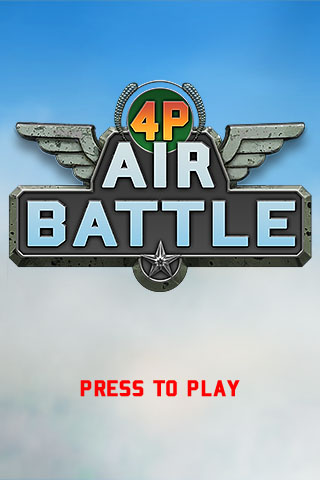
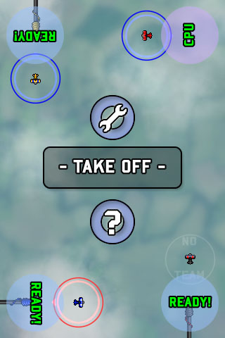
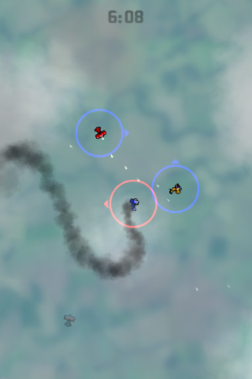
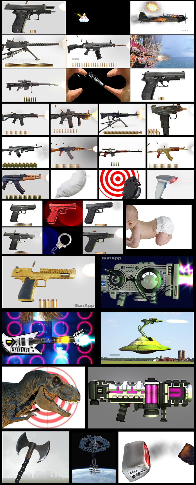
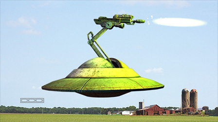
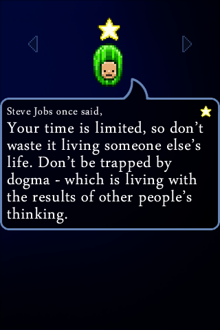
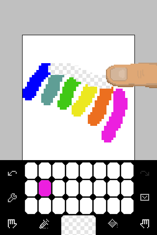
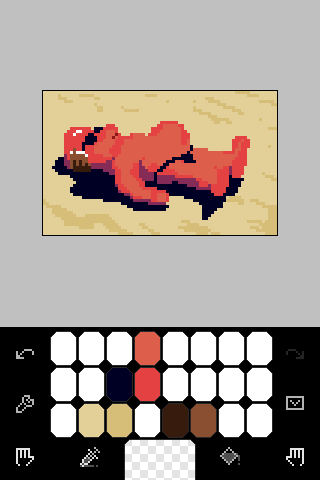
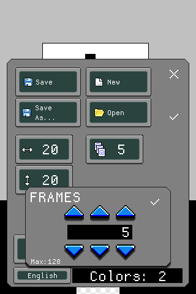

# LFA Engine
This is a very lightweight C++ OpenGL wrapper and basic 2D game engine designed to be portable between Windows, OSX, Linux, and iOS (and even Android, as GunApp at one point did have an Android port that ran this C++ code!).
LFA Engine is the backbone of the games GunApp, 4P Air Battle, Guru Melon, and Pixation that were once published on iOS and designed for early versions of the iPhone and iPod Touch.   

LFA Engine was developed from 2008 until about 2013, and has dependencies on [SDL](https://libsdl.org/) (for the OGL context) and the Hekkus Sound System by Thomas Maniero.  I don't have a license to publish Hekkus, so I can not post the source here, but if you can't obtain it, calls to Hekkus can be easily replaced to use a different sound library in the sound manager (including FMOD, or even to SDL sound, which was originally used, but had problems in those days being ported).

LFA Engine may still useful if you want to develop a very lightweight game for very low-end hardware that Unity or UE3 are too heavy for.

The basic building block for using the engine is the QuadSet class, which is used to draw.  Everything else flows from there.

As might be expected, the engine uses bitmap fonts for simplicity:
*bombadierTGA.tga*, *Dina.tga*, *arabTypeTGA.tga* and *glyphs.wstring* are added for convinence to be able to start with some GUI.

**4p Air Battle**

**GunApp**

**Guru Melon**

**Pixation**

