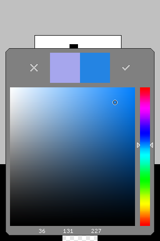

# LFA Engine
This is a very lightweight C++ OpenGL wrapper and basic 2D game engine designed to be portable between Windows, OSX, Linux, and iOS (and even Android, as GunApp at one point did have an Android port that ran this C++ code!).
LFA Engine is the backbone of the games GunApp, 4P Air Battle, Guru Melon, and Pixation that were once published on iOS and designed for early versions of the iPhone and iPod Touch.   

The Engine was developed from 2009 until about 2013, and has dependencies on SDL (for the OGL context) and the Hekkus Sound System by Thomas Maniero.  I don't have a license to publish Hekkus, so I can not post the source here, but if you can't obtain it, calls to Hekkus can probably be easily replaced to use a different sound library based on how the code is written.

LFA Engine may still useful if you want to develop a very lightweight game for very low-end hardware that Unity or UE3 are too heavy for.

**4p Air Battle**

**GunApp**

**Guru Melon**

**Pixation**

